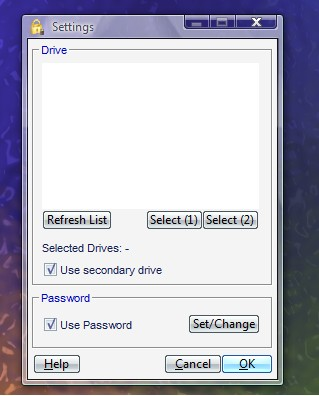



## RM Secure

### Description

RM Secure is an application which allows you to secure your PC with just a flash drive, CD or floppy disk.

The basic idea is that it scans the serial number of the removable media and looks whether it is present when you want to unlock it.

The lock consists of constant hiding windows. This may result to slow reaction (but as it is locked, to do nothing, I don't see the problem here).

When using something like WindowBlinds, Windows might suffer from bad refreshing or it might show title-bars that shouldn't be there.
 
### More Info
 

             |
---                |---
**Submitted On**   |2006-11-11 14:42:34
**By**             |[TheBigB](https://github.com/Planet-Source-Code/PSCIndex/blob/master/ByAuthor/thebigb.md)
**Level**          |Intermediate
**User Rating**    |5.0 (10 globes from 2 users)
**Compatibility**  |VB 6\.0
**Category**       |[Complete Applications](https://github.com/Planet-Source-Code/PSCIndex/blob/master/ByCategory/complete-applications__1-27.md)
**World**          |[Visual Basic](https://github.com/Planet-Source-Code/PSCIndex/blob/master/ByWorld/visual-basic.md)
**Archive File**   |[RM\_Secure20301611112006\.zip](https://github.com/Planet-Source-Code/thebigb-rm-secure__1-67048/archive/master.zip)

